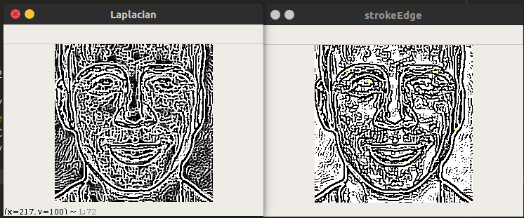

# my_opencv_exam
##This repo is for this book<Learning OpenCV3 Computer Vision with Python 2nd Edition>
##Environment:
python3.5(anaconda),
Ubuntu14.04LTS
## ch02
2_1 3  
result:
RandomGray:

RandomColor:

##ch03

3_1 HPF(High boost filter)
result:

----
3_4 StrokeEdge
result:

----
3_5 defined filter
result:

f_i:The i times result
----
3_7 canny function

result:

----
3_8 findContours

result:

--------

the function of cv_threshold:

result:

----
3_9 findContours+  
result:  

(emmm this pic is not good for this exem)
----------

5_3_1 detect face using harrcascades   
result:  

----------continuing------------

