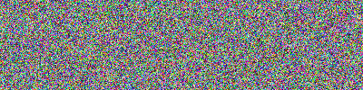

# my_opencv_exam

## ch02
----------------------
2_1 3  result:

-------------------

3_1 HPF(High boost filter)
result:

3_4 StrokeEdge
result:

3_5 defined filter
result:

f_i:The i times result

3_7 canny function
result:

